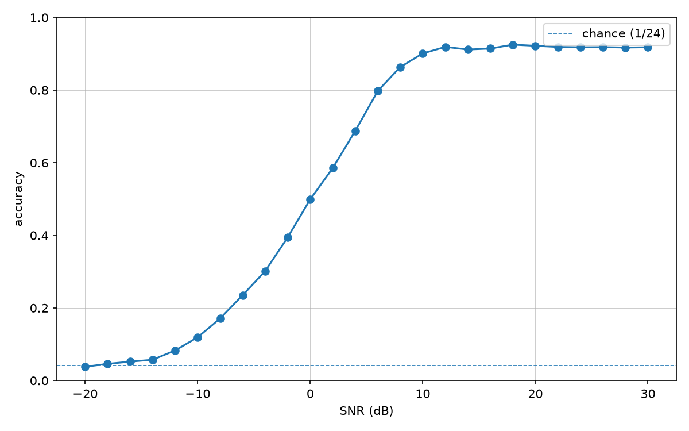
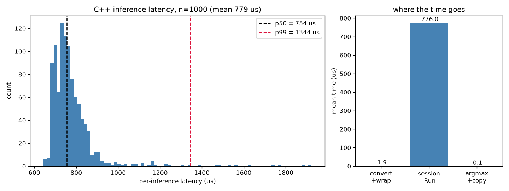

# RF Signal Modulation Classification with a C++ Inference Pipeline

Train a CNN to classify radio modulation types from raw IQ samples
(RadioML 2018.01a, 24 classes), export it to ONNX, and serve it from a C++
streaming pipeline that measures real latency, throughput, and memory — with
the C++ predictions validated to **exact parity** with PyTorch.

## Results

**Accuracy** (held-out test set, PyTorch):

| SNR | accuracy |
|---|---|
| above +10 dB | ~92% |
| 0 dB | ~50% |
| −10 dB | ~12% |
| −20 dB | ~4% (chance = 1/24) |

The aggregate accuracy over the full −20..+30 dB sweep (~55%) is close to
meaningless without this curve — reporting it *by SNR* is the point:



**C++ pipeline** (ONNX Runtime, CPU, 1000 single-sample inferences,
Release build, 50-run warm-up, `steady_clock` around `predict()` only):

| metric | value |
|---|---|
| parity with PyTorch argmax | **1000 / 1000 exact** |
| throughput | ~1,290 inferences/s |
| latency mean / p50 / p99 | 775 µs / 725 µs / ~1.7 ms |
| peak working set | 55 MB |

Per-stage profiling shows `session.Run` is **99.7%** of per-inference time
(layout conversion: 1.4 µs; argmax: 0.1 µs). A two-thread producer/consumer
pipelining experiment (Exercise 8) was measured and **did not help** — there
was ~1.4 µs of work available to hide behind a ~775 µs stage, and the
synchronization cost more than it saved. The negative result is reported as
measured; the only way to go meaningfully faster is inside the model
(quantization, batching, a smaller head), not around it.



## Structure

```
python/
├── src/        # dataset.py, model.py, train.py, evaluate.py, export.py,
│               # dump_test_bin.py (binary test dump for C++), plot_latency.py
├── tests/      # pytest suite (model shapes, train step, export parity, eval)
└── data/       # gitignored — dataset lives here locally
cpp/
├── src/        # iq_reader, classifier (ONNX Runtime), stats, benchmark
├── tests/      # parity test (exact match vs. PyTorch preds), stats test
└── third_party/  # gitignored — ONNX Runtime prebuilt release goes here
docs/
├── report-guide.md          # structure + all measured numbers for the report
├── understanding-guide.md   # background + walkthrough of each exercise
└── *.png                    # result figures
```

## Model

1D CNN over raw IQ (2 × 1024), ~2.2M parameters: four Conv1d→ReLU→MaxPool
blocks (channels 64-64-128-128), then FC 8192→256→24 logits. Raw IQ was
chosen over spectrograms deliberately: magnitude spectrograms discard phase,
and phase is exactly where PSK/QAM schemes encode information.

## Reproducing

### 1. Dataset

**DeepSig RadioML 2018.01a** (2,555,904 examples; 24 classes × 26 SNRs).
Requires accepting terms at https://www.deepsig.ai/datasets — not committed
or downloaded automatically. Place `GOLD_XYZ_OSC.0001_1024.hdf5` under
`python/data/dataset/`.

### 2. Python: train, evaluate, export

```
cd python
pip install -r requirements.txt
python src/train.py data/dataset/GOLD_XYZ_OSC.0001_1024.hdf5          # ~10 epochs
python src/evaluate.py data/dataset/GOLD_XYZ_OSC.0001_1024.hdf5 checkpoints/best.pt
python src/export.py checkpoints/best.pt checkpoints/model.onnx
python src/dump_test_bin.py data/dataset/GOLD_XYZ_OSC.0001_1024.hdf5 checkpoints/best.pt
pytest
```

### 3. C++: build and benchmark (Windows / MSVC)

Download the `onnxruntime-win-x64-1.27.1` release zip from
https://github.com/microsoft/onnxruntime/releases and extract it into
`cpp/third_party/`.

```
cd cpp
cmake -B build -DCMAKE_BUILD_TYPE=Release
cmake --build build --config Release
build\Release\rf_parity_test.exe ..\python\checkpoints\model.onnx data\test_slice.bin
build\Release\rf_benchmark.exe   ..\python\checkpoints\model.onnx data\test_slice.bin [latencies.csv] [--pipeline]
```

## How this project was built

This is a learning project built exercise-by-exercise alongside Claude Code —
see `instructions.md` for the phase plan and `docs/understanding-guide.md`
for the reasoning behind each exercise. The core logic — the model's
`forward()`, the training step, the accuracy-by-SNR analysis, export
verification, the ONNX Runtime inference call, and the latency
instrumentation — was implemented by hand so that every design decision can
be defended in an interview.
